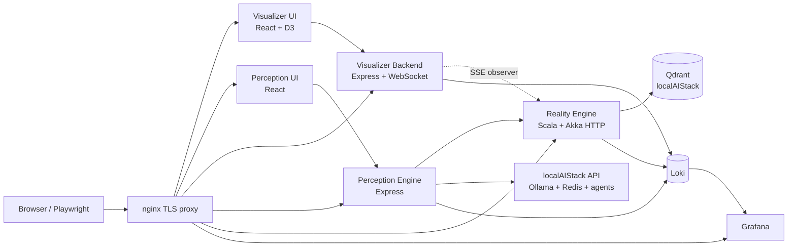
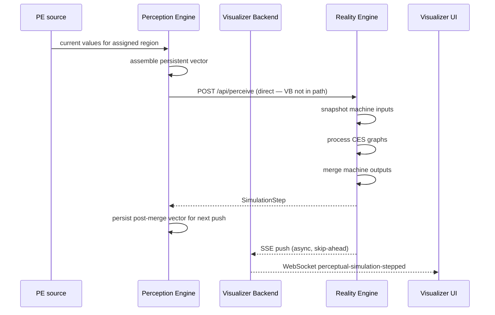
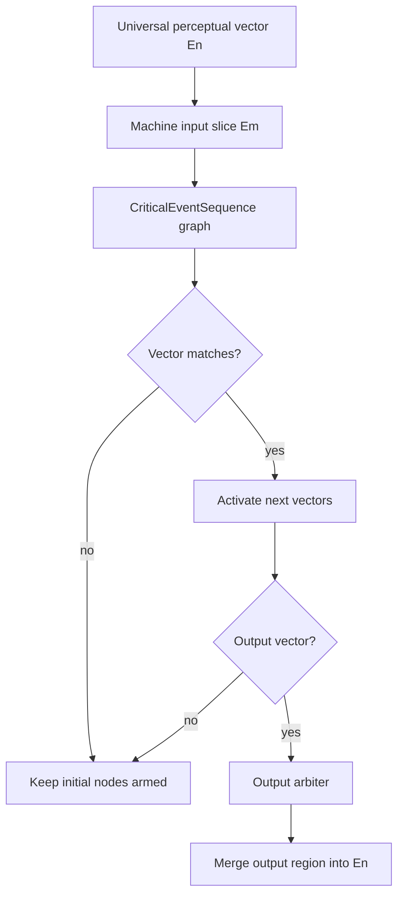

# RealityEngine_AI Architecture

RealityEngine_AI is the reference implementation for the Reality Engine
universe: Scala/Akka for the core engine, Node/React for perception and
visualization, and localAIStack for shared AI infrastructure.

## System Map

## Runtime Services

| Service | Runtime | Default external URL | Responsibility |
| --- | --- | --- | --- |
| Reality Engine | Scala 2.13 / Akka HTTP | `https://localhost:3000` | Machine registry, CES processing, perceptual-space simulation. |
| Visualizer Backend | Node.js / Express / ws | `https://localhost:3001` | API proxy and step-result WebSocket broadcast. |
| Visualizer Frontend | React / TypeScript / D3 | `https://localhost:5173` | Tobias canvas, machine administration, interconnection graph. |
| Perception Engine Backend | Node.js / Express / ws | `https://localhost:3004` | Source assembly, push loop, localAI bridge signals. |
| Perception Engine Frontend | React / TypeScript | `https://localhost:3005` | Source management and live push controls. |
| nginx | nginx | all HTTPS ports | TLS/WSS termination and routing. |
| Qdrant | localAIStack | `http://localhost:6333` | Shared vector database owned by localAIStack. |
| Loki / Grafana | Docker services | `https://localhost:3002` | Log aggregation and dashboards. |

## Data Flow

## Perceptual Vector Model

| Concept | Current rule |
| --- | --- |
| Dense compatibility floor | `768` elements. |
| Logical dimension | Dynamic: highest active machine/source `offset + length`. |
| Source writes | PE overwrites only each source's assigned region. |
| Machine reads | RE snapshots every machine input before processing. |
| Machine writes | RE merges outputs after all machines process. |
| Persistence | PE carries the post-merge vector into the next push. |
| localAIStack embeddings | Separate semantic vectors; do not resize them for RE operational vectors. |

## Machine Processing

| Component | Responsibility |
| --- | --- |
| `RealityVector` | Compares input elements using `gte`, `equals`, or `threshold`. |
| `CriticalEventSequence` | Maintains active graph nodes and emits output vectors. |
| `Machine` | Runs sequences and owns input/output perceptual mappings. |
| `OutputArbiter` | Decides whether matched outputs should be asserted. |
| `PerceptualSpaceSimulator` | Runs snapshot -> process -> merge simulation phases. |
| `Perception Engine` | Builds the next input vector from test, simulated, and sensor sources. |

## Startup Contract

| Step | Check |
| --- | --- |
| 1 | `startUniverse.sh` starts localAIStack dependencies when needed. |
| 2 | Reality Engine loads every `examples/machines/*.json`. |
| 3 | Perception Engine creates startup sources for machine `inputSequences`. |
| 4 | Optional localAIStack bootstrap registers bridge sensor sources. |
| 5 | Visualizer Backend subscribes to RE's SSE stream as a passive observer. |
| 6 | Visualizer UI connects through nginx and subscribes to VB WebSocket broadcasts. |

## Documentation Set

| Need | Primary document |
| --- | --- |
| Start the full stack | [QUICKSTART.md](QUICKSTART.md) |
| Current architecture | [ARCHITECTURE.md](ARCHITECTURE.md) |
| Perceptual vector model | [PERCEPTUAL_SPACE_ARCHITECTURE.md](PERCEPTUAL_SPACE_ARCHITECTURE.md) |
| Machine interconnections | [docs/MACHINE_INTERCONNECTION.md](docs/MACHINE_INTERCONNECTION.md) |
| Machine corpus index | [docs/EXAMPLE_DOMAIN_COMPENDIUM.md](docs/EXAMPLE_DOMAIN_COMPENDIUM.md) |
| Domain layout and bridge block | [docs/DOMAIN_PERCEPTUAL_SPACE_REMAP.md](docs/DOMAIN_PERCEPTUAL_SPACE_REMAP.md) |
| Acronyms | [docs/ACRONYMS.md](docs/ACRONYMS.md) |
| Bibliography | [docs/BIBLIOGRAPHY.md](docs/BIBLIOGRAPHY.md) |
