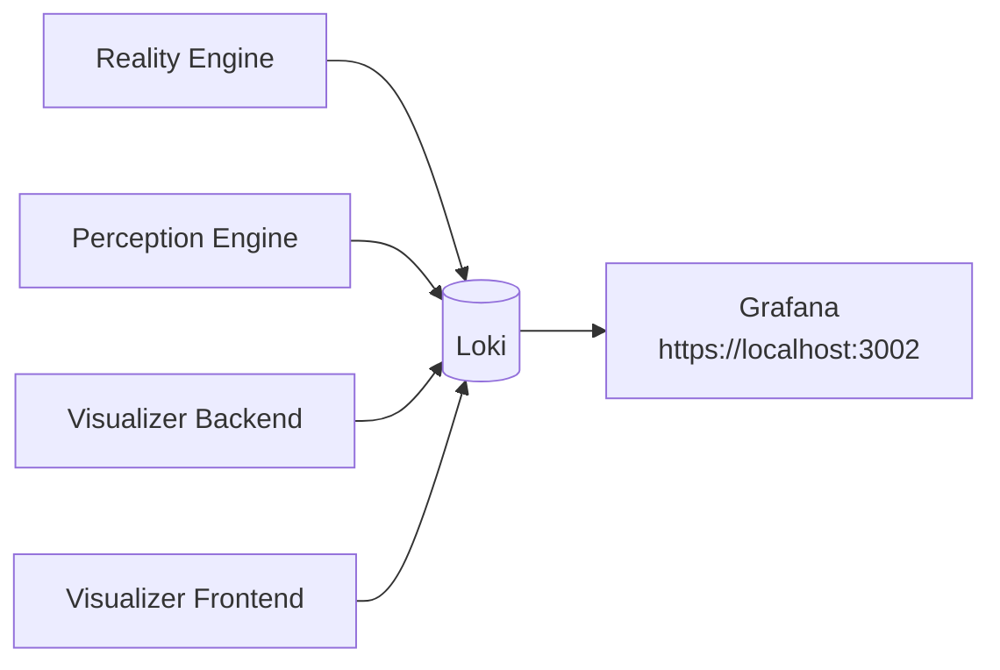

# Logging Quick Start

RealityEngine_AI forwards service logs to Grafana Loki and views them in
Grafana.

## Picture



## Access

| Tool | URL | Notes |
| --- | --- | --- |
| Grafana | `https://localhost:3002` | Login `admin / admin`. |
| Loki | `http://localhost:3100` | Internal log query backend. |

## Common Queries

| Need | LogQL |
| --- | --- |
| All logs | `{app="reality-engine"}` |
| One service | `{app="reality-engine", service="reality-engine"}` |
| Errors | `{app="reality-engine"} \|~ "(?i)error"` |
| Perception Engine | `{app="reality-engine", service="perception-engine-backend"}` |
| Visualizer Backend | `{app="reality-engine", service="visualizer-backend"}` |

## Startup

```bash
./startUniverse.sh
```

The startup script checks the Loki Docker log driver before starting services.
Use [LOKI_GRAFANA_SETUP.md](LOKI_GRAFANA_SETUP.md) for setup details.
