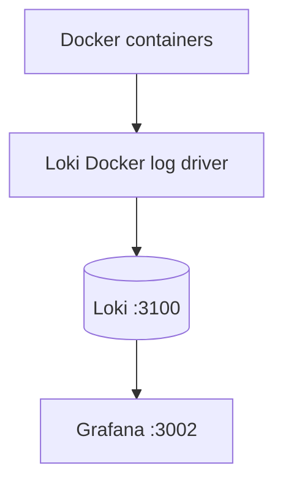

# Loki And Grafana Setup

RealityEngine_AI uses Grafana Loki for centralized logs and Grafana for query
and dashboard views.

## Architecture



## Components

| Component | Port | Purpose |
| --- | ---: | --- |
| Loki | `3100` | Stores and queries logs. |
| Grafana | `3002` | UI for dashboards and LogQL. |
| Loki Docker driver | n/a | Sends container logs to Loki. |

## Setup

```bash
./scripts/setup-loki-driver.sh
./startUniverse.sh
```

If the driver is already installed, `startUniverse.sh` only verifies it.

## Useful Commands

| Command | Purpose |
| --- | --- |
| `curl http://localhost:3100/ready` | Check Loki readiness. |
| `curl -k https://localhost:3002/api/health` | Check Grafana health. |
| `docker compose logs -f <service>` | Read raw container logs. |

## Useful LogQL

| Need | Query |
| --- | --- |
| All Reality Engine logs | `{app="reality-engine"}` |
| Errors only | `{app="reality-engine"} \|~ "(?i)error"` |
| Log count by service | `sum(count_over_time({app="reality-engine"}[5m])) by (service)` |
| Log rate | `rate({app="reality-engine"}[1m])` |

## Retention

| Setting | Value |
| --- | --- |
| Retention | 30 days |
| Compaction | 10 minutes |
