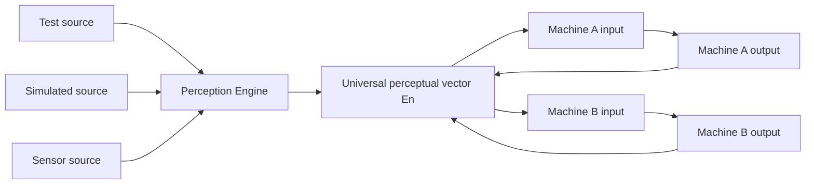

# Perceptual Space Architecture

The perceptual space is a shared, dynamically sized operational vector. Machines
read input regions and write output regions inside that vector.

## Model



| Term | Meaning |
| --- | --- |
| `En` | Universal perceptual vector. |
| `Em` | Machine-local slice extracted from `En`. |
| Region | `{ offset, length }` reservation inside `En`. |
| Compatibility floor | Dense vectors start at `768` elements. |
| Runtime dimension | `max(768, max(offset + length))` across active machines and sources. |

## Processing Rule

| Phase | What happens |
| --- | --- |
| Snapshot | Every machine reads its input region from the same pre-step vector. |
| Process | CES graphs match vectors and prepare outputs. |
| Merge | Outputs are written to output regions in deterministic order. |
| Persist | PE uses the post-merge vector as the base for the next push. |

## Region Example

```text
Positions: 0      4      8     12                  768+
           |------|------|------|--------------------|
Machine A: input         output
Machine B:        input         output
Machine C:               input          output
```

If Machine A writes into a region read by Machine C, C sees that value on the
next push because the Perception Engine preserves output regions that no source
overwrites.

## Storage Boundary

| Vector type | Owner | Dimension rule |
| --- | --- | --- |
| Reality operational vector | Reality/Perception Engine | Dynamic runtime dimension. |
| Machine/source mapping | Machine corpus and PE source registry | Explicit `{offset,length}`. |
| Semantic embedding vector | localAIStack/Ollama/Qdrant collections | Fixed model embedding dimension. |

Operational reality vectors must not force localAIStack embedding collections to
resize. If operational snapshots need persistence, use separate collections or a
sparse region store under Reality Engine ownership.

## Current Corpus

The generated machine corpus is documented in:

- [docs/EXAMPLE_DOMAIN_COMPENDIUM.md](docs/EXAMPLE_DOMAIN_COMPENDIUM.md)
- [docs/DOMAIN_PERCEPTUAL_SPACE_REMAP.md](docs/DOMAIN_PERCEPTUAL_SPACE_REMAP.md)
