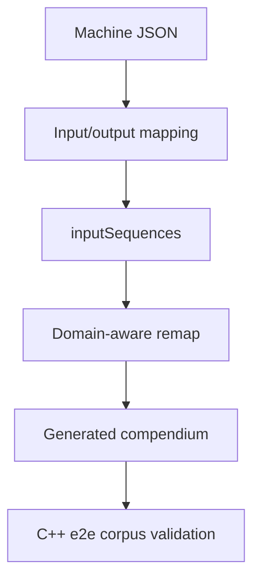

# Interconnected Machines Setup

Use this page as the short operational checklist for adding or validating
interconnected machines.

## Checklist

| Step | Action |
| --- | --- |
| 1 | Add machine JSON under `examples/machines/`. |
| 2 | Define `perceptualMapping.input` and `perceptualMapping.output`. |
| 3 | Add `inputSequences` with expected-output metadata. |
| 4 | If output feeds another domain, intentionally overlap the downstream input region. |
| 5 | Run `node scripts/remap_machine_connection_matrix_by_domain.mjs`. |
| 6 | Regenerate `docs/EXAMPLE_DOMAIN_COMPENDIUM.md`. |
| 7 | Run `cd ../RealityEngine_CPP && make e2e`. |

## Visual Model

## Source Startup

At startup the Perception Engine creates test sources from machine
`inputSequences` so authored sequences can be replayed through the same PE -> RE
push path used by live sources.
