# Life Balance Machines

The `life-balance` domain contains `100` example machines that model
lifestyle-psychiatry workflow support. The examples are inspired by public
descriptions of Ann Childers, MD's lifestyle psychiatry approach: mainstream
general and adolescent psychiatry combined with nutrition, sleep, metabolic
monitoring, genetics/temperament testing, and general health behavior support.

These examples are automation and tracking models only. They do not diagnose,
treat, or replace licensed clinical judgment.

## Workflow Map

```mermaid
flowchart LR
  Intake[Intake and goals] --> Nutrition[Nutrition and metabolic health]
  Nutrition --> Sleep[Sleep and circadian rhythm]
  Sleep --> Movement[Movement and physical health]
  Movement --> Stress[Stress and psychotherapy]
  Stress --> Meds[Medication and psychiatric care]
  Meds --> Family[Adolescent family and school]
  Family --> Testing[Testing and monitoring]
  Testing --> Social[Connection and harm reduction]
  Social --> Projection[Projection and automation]
```



## Workstreams

| Workstream | Machines | Primary metrics |
| --- | ---: | --- |
| Whole Person Intake And Goals | 10 | psychiatric history, lifestyle baseline, readiness, safety, function |
| Nutrition And Metabolic Health | 10 | meal timing, glycemic stability, protein, hydration, food-mood response |
| Sleep And Circadian Rhythm | 10 | duration, regularity, insomnia triggers, light timing, daytime function |
| Movement And Physical Health | 10 | activity dose, strength, aerobic minutes, recovery, pain constraints |
| Stress Resilience And Psychotherapy | 10 | stress load, coping skill use, therapy homework, recovery rhythm |
| Medication And Psychiatric Care | 10 | response, side effects, adherence, appetite, sleep, safety |
| Adolescent Family And School | 10 | school function, family routines, device boundaries, peer connection |
| Testing Personalization And Monitoring | 10 | CGM, genetics, temperament, labs, wearables, outcome scores |
| Social Connection And Harm Reduction | 10 | support network, substance exposure, digital load, social rhythm |
| Projection Automation And Outcomes | 10 | risk drift, plan adjustment, escalation, scheduling, command center |

## Output Semantics

| Output | Meaning |
| --- | --- |
| `[1,0,0,0]` | Care-team review |
| `[0,1,0,0]` | Lifestyle plan adjustment |
| `[0,0,1,0]` | Monitoring task |
| `[0,0,0,1]` | Stable balance |

Every machine has at least five authored `inputSequences`, exceeding the
minimum of three requested sequences.

## Domain End-To-End Sequences

Five domain-level e2e sequences are embedded in machines `LBL096` through
`LBL100` and are exercised by the corpus runner:

| Machine | Sequence |
| --- | --- |
| `LBL096` | Domain E2E metabolic mood projection |
| `LBL097` | Domain E2E adolescent sleep school projection |
| `LBL098` | Domain E2E medication lifestyle projection |
| `LBL099` | Domain E2E stress connection projection |
| `LBL100` | Domain E2E command center projection |

## Regeneration

```bash
python3 scripts/generate_life_balance_machines.py
node scripts/remap_machine_connection_matrix_by_domain.mjs
node scripts/generate_example_machine_compendium.mjs
```

Then validate from the C++ repository:

```bash
cd ../RealityEngine_CPP
make e2e
```

## References

- Ann Childers, MD public speaker biographies describing lifestyle psychiatry,
  nutrition, sleep, general health, CGM testing, genetics testing, and
  temperament testing.
- Lifestyle psychiatry literature describing lifestyle medicine pillars applied
  to psychiatric care.
