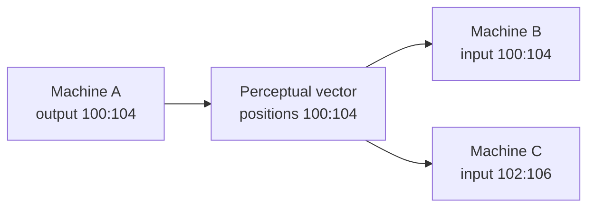

# Machine Interconnection

Machines interconnect when one machine's output region overlaps another
machine's input region.

## Connection Rule



| Overlap | Meaning |
| --- | --- |
| Output -> input, same domain | Domain-local machine flow. |
| Output -> input, different domains | Cross-domain bridge flow. |
| Input -> input only | Shared observation, not an activation edge. |
| Output -> output only | Write collision; last deterministic merge wins for overlap. |

## Runtime Timing

| Push N | Push N+1 |
| --- | --- |
| Machine A reads pre-step input and writes output after merge. | Machine B reads A's persisted output if no source overwrote it. |

The engine is input-atomic: a machine cannot activate another machine during the
same snapshot/process/merge cycle.

## Current Matrix

| Document | Purpose |
| --- | --- |
| [EXAMPLE_DOMAIN_COMPENDIUM.md](EXAMPLE_DOMAIN_COMPENDIUM.md) | Searchable machine and interconnection index. |
| [DOMAIN_PERCEPTUAL_SPACE_REMAP.md](DOMAIN_PERCEPTUAL_SPACE_REMAP.md) | Packed domain blocks and cross-domain bridge block. |
| [../MACHINE_INTERCONNECTION_MAP.md](../MACHINE_INTERCONNECTION_MAP.md) | Legacy core-machine connection examples. |

## Validation

The C++ end-to-end corpus runner loads every example machine and executes all
authored `inputSequences`:

```bash
cd ../RealityEngine_CPP
make e2e
```
